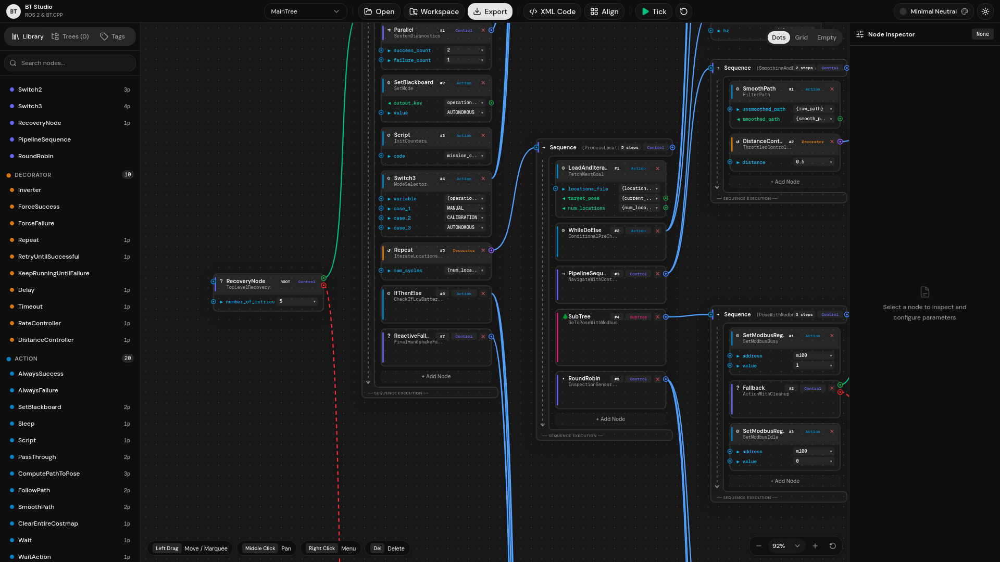
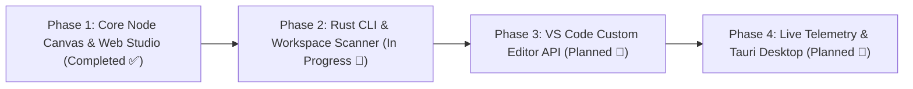

# Behavior Tree Studio

<div align="center">

**Modern, interactive Behavior Tree visualizer, editor, and studio for ROS 2 (Nav2) and BehaviorTree.CPP v3/v4.**

[](LICENSE)
[](https://docs.ros.org/)
[](https://www.behaviortree.dev/)
[](https://pnpm.io/)
[](https://vercel.com)

<br/><br/>



</div>

---

## 🚀 Overview

**Behavior Tree Studio** is an industrial-grade, visual development environment designed for robotics engineers working with **ROS 2 Navigation2 (Nav2)** and **BehaviorTree.CPP (Groot2)**.

Instead of rigid, vertical tree hierarchies or cluttered charts, Behavior Tree Studio delivers a sleek, fluid node graph inspired by modern digital content creation tools (Blender, Unreal Engine, NVIDIA Isaac-Sim). It visualizes execution flow from left to right, clearly communicates branch priorities, provides type-safe blackboard parameter connections, and features an integrated bidirectional XML code editor.

---

## ✨ Key Features

### 🎨 Fluid, Modular Node Canvas
- **Horizontal Time & Priority Flow:** Logical left-to-right execution structure where branch order and fallback paths are immediately clear.
- **Dual Output Execution Sockets:** Control nodes like `RecoveryNode` and `IfThenElse` render distinct **Success** and **Failure** sockets, avoiding ambiguous wiring.
- **Smart Leaf Node Rules:** Leaf nodes (`Action`, `Condition`) strictly prohibit child execution sockets, matching Behavior Tree semantics.
- **Non-Destructive Detachment:** Disconnecting a wire preserves disconnected subtrees as floating canvas nodes rather than deleting them.
- **Multi-Select & Bulk Operations:** Marquee drag selection, multi-node repositioning, and batch deletion (`Delete`/`Backspace`).

### 🏷️ Type-Safe Blackboard Tags & Data Wires
- **Interactive Drag-to-Spawn:** Drag directly from input or output parameter pins into open canvas space to create blackboard parameter tag cards.
- **Direction-Aware Wiring:**
  - **Input parameters** (sky blue): Tag feeds value into the node's left pin.
  - **Output parameters** (emerald green): Node feeds resulting value into the tag's left pin.
- **Strong Typing:** Supports ROS 2 types (`geometry_msgs::msg::PoseStamped`, `double`, `string`, `bool`, etc.).
- **In-Place Modification:** Click any tag value box to edit blackboard keys (`{target_pose}`) or static values directly.

### 📝 Integrated XML Code Studio & Editor
- **Resizable XML Drawer:** Slide open an interactive code drawer that can be resized freely.
- **Bidirectional Live Synchronization:** Changes on canvas instantly update the XML; edits made in the code drawer compile directly onto the canvas (`Ctrl+S` / `Cmd+S` or "Apply Changes").
- **Real-Time XML Validator:** Powered by `fast-xml-parser` with actionable error notifications and exact line numbers.
- **Canvas-to-Code Highlighting:** Selecting any node on the canvas instantly highlights its corresponding XML block in the code view.
- **SubTree Scoping:** Accurately highlights nodes within their enclosing `<BehaviorTree ID="...">` block, eliminating ambiguous regex matching.

### 🌓 Premium Shadcn Theming & Canvas Controls
- **Color Palettes:** Curated themes including **Neutral**, **Claude**, **Zinc**, **Slate**, and **Rose** with Dark/Light modes.
- **Floating HUD & Controls:** Real-time zoom indicator with quick-select menu (`50%`, `75%`, `100%`, `125%`, `Fit`), blueprint grid switcher (Dots, 36px Grid, Empty), and keybinding helper pills.
- **Middle-Click Pan & Smooth Zoom:** Natural viewport navigation with trackpad pinch or mouse wheel zoom and middle-click drag pan.

---

## 🏗️ Architecture

The project is structured as a modular monorepo:

```text
behavior-tree-viewer/
├── app/                  # Web Visualizer (React 19 + Vite + D3.js + Tailwind CSS v4 + Radix UI)
│   ├── src/components/canvas/   # D3 rendering, modular node shapes, wire calculation
│   ├── src/components/code-drawer/ # Interactive XML Code Editor
│   └── src/features/xml/        # XML parser, validator, AST generator, formatter
├── crates/               # High-Performance Rust Workspace
│   ├── bt-core/          # BehaviorTree parser, AST, schema validator in Rust
│   └── bt-cli/           # "btview" CLI tool for workspace scanning, linting, local HTTP server
├── src/                  # VS Code Extension Host (TypeScript + Webpack)
│   └── extension.ts      # Webview panel manager & editor document sync
├── vercel.json           # Vercel zero-config single-page application deployment
├── package.json          # Root scripts & dependencies (Strictly pnpm)
└── Cargo.toml            # Rust workspace definition
```

---

## 🗺️ Roadmap



- [x] **Phase 1: Core Canvas & Web Studio**
  - Modular node renderers (`StandardCard`, `SequenceCard`, `DecoratorCard`)
  - Blackboard tag nodes with direction-aware data wires
  - Resizable interactive XML Code Editor with live validation and line gutters
  - Multi-theme engine, zoom controls, and marquee selection
  - Vercel cloud deployment support
- [ ] **Phase 2: Rust CLI (`btview`) & Workspace Scanner**
  - `btview scan <dir>` to discover all ROS 2 Nav2 BT XMLs and `TreeNodesModel` definitions
  - CLI tree linter for cyclic dependencies and undefined blackboard keys
  - Local hot-reloading HTTP file server
- [ ] **Phase 3: VS Code Custom Editor API**
  - Seamless native `.xml` custom visual editor in VS Code
  - Automatic workspace discovery of custom node libraries
- [ ] **Phase 4: Live Telemetry & Standalone Desktop**
  - ROS 2 ZeroMQ / WebSocket bridge for live node state telemetry (`IDLE`, `RUNNING`, `SUCCESS`, `FAILURE`)
  - Standalone desktop bundles via Tauri (Linux, macOS, Windows)

---

## 💻 Getting Started

### Prerequisites
- **Node.js** >= 18
- **pnpm** >= 9 (Do not use `npm` or `yarn`)
- **Rust & Cargo** (optional, required only for building `crates/`)

### 1. Web Studio (Local Development)

```bash
# Clone the repository
git clone https://github.com/omrfrkmll/behavior-tree-viewer.git
cd behavior-tree-viewer

# Install dependencies
pnpm install

# Start Vite development server
pnpm app:dev
```
Open [http://localhost:5173](http://localhost:5173) in your browser.

### 2. Production Build

```bash
pnpm app:build
```
Build output will be generated in `dist-app/`.

### 3. VS Code Extension

```bash
# Compile extension host bundle
pnpm run compile

# Launch VS Code with extension in debug mode
# Press F5 inside VS Code
```

### 4. Rust CLI (`btview`)

```bash
# Build workspace
pnpm run rust:build

# Run tests
pnpm run rust:test
```

---

## ☁️ Deployment (Vercel)

Behavior Tree Studio is ready for instant deployment on Vercel:

1. Import this repository in [Vercel](https://vercel.com).
2. The included [`vercel.json`](vercel.json) will configure the build command (`pnpm app:build`) and output directory (`dist-app`) automatically.
3. Deploy!

---

## 📄 License

This project is licensed under the [MIT License](LICENSE).
